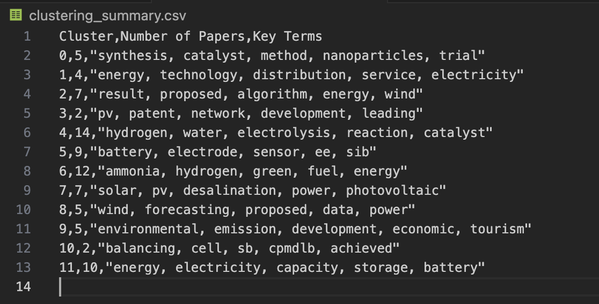

# Paper Clustering Project

This project is designed to cluster academic papers based on their abstracts. The process involves data processing, vectorisation, and clustering. The results and summaries are stored in CSV files for easy analysis.

## Features

1. **Data Processing**:
   - Utilizes Selenium and BeautifulSoup to scrape abstract text content from academic papers.
   
2. **Vectorisation and Clustering**:
   - Implements TF-IDF vectors to convert text data into numerical vectors.
   - Uses the Elbow method, silhouette scores the vectorisation.
   - Uses KMeans for clustering.

3. **Results Storage**:
   - Saves the clustering results into `clustering_results.csv`, indicating which papers belong to each cluster.
   - Stores the clustering summary, including the number of papers in each cluster and the key terms or topics associated with each cluster, into `clustering_summary.csv`.

## Usage

To run the clustering process, follow these steps:

1. **Ensure you have the required packages installed by running**:
```sh
pip install -r requirements.txt
```

2. **Execute the script**:
```sh
python cluster.py
```

## Result

**Example of clustering_summary.csv**:


